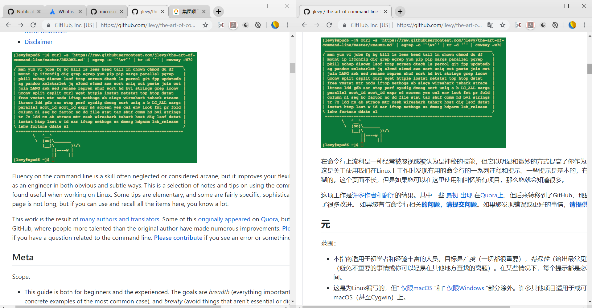

## 学和用 - 英文修炼法

你从小学就开始学英语, 一直学到大学, 不管你的水平是怎么样, 你一定思考过一个问题: "学英语到底有啥用?"

尤其是那些英语学的不太好的同学们, 我曾听过很多论调, 说中国人学啥英语, 又不出国, 也用不上, 可是真正到用上英语的时候, 他们又说他们看不懂.

这个编程世界的主流语言是英语, 这个我们必须承认, 最大的开源社区是英文, 最大的编程问答社区是英文, 超过95%的框架, 技术文档默认语言是英语.

这篇文章面向的读者, 主要是那些目前英语水平不好, 读各种英文资料吃力, 但是又深感英文重要的那些人.

在适应英文世界的初期, 首先我们要在工具和社区上做出改变:

- 搜索编程类问题时, 放弃中文搜索引擎(尤其是百度), 改用英文搜索引擎, 国内有 bing 国际版, 科学上网可行的话, 用 Google.

- 多进入英文编程社区活动, 比如 Github, 它本身是个英文社区, 如果你经常逛的话, 自然就熟了.

- 学框架和技术的时候, 养成上官网看文档和教程的习惯, 文档就是 Doc, 一般有两种, Reference Doc 和 API Doc, Reference Doc就是教你怎么用, 而 API doc 就是一个详细的 API 文档, 更加细致, 类似于字典, 供查阅.

接下来, 我们要处理一个很现实的问题, 在融入英语世界的前期, 可能会出现啥也看不懂的局面, 如何破解这一局面? 

我推荐在前期, 使用 Google 网页翻译, 分屏操作.

什么是分屏?

分屏就是这样:

左边英文, 右边中文, 对照的看, 然后词汇量实在感人的话, 可以把生词记一记, 这样有中文辅助的看, 相当于给你一个拐棍, 等你英语好起来了, 就可以不看右边的了.

分屏快捷键之类的, 自己去查吧.

即便你英语可能是一个不到四级的水平, 但这样做的话, 可能不到半年你就熟练了.

学英语最佳方法就是学以致用, 现在学习编程的时候, 正好可以用英语了, 这不是正好吗?
