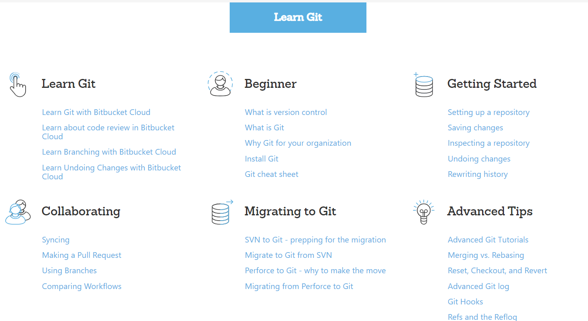

## Git 版本控制与历史记录

>我尝试过很多Git学习资源, 当然也读过官方文档, 但目前来说, 我发现了最好的一个学习资源, 在质量上, 易读性上, 它都为我见过的最佳。

## [BitBucket提供的系统Git教程](https://www.atlassian.com/git/tutorials)

整个教程页, 图文说明很详细, 解释的也绝对到位:

宁缺毋滥, 暂时就给大家安利这一个Git学习资源, 其他的我后续发现会加到这个文件里, 也欢饮大家分享你们的资源。
